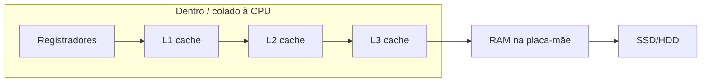
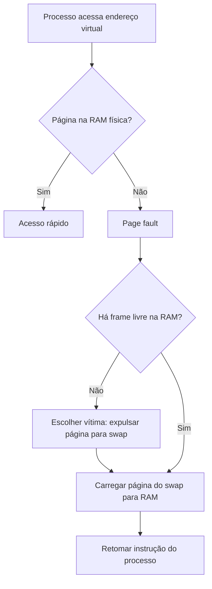

# Memory: physical PC, frequencies, swap, limits, loops, and “pointers”

**PT:** [memoryphysicaldeepdive.md](memoryphysicaldeepdive.md)

Complement to [memoryandreferences-en.md](memoryandreferences-en.md). Here: **hardware curiosity**, **why swap exists**, **orders of magnitude**, **limits**, and **diagrams** (Mermaid + ASCII) — in editors like VS Code/Cursor/GitHub, `mermaid` blocks can be previewed with an extension or on [mermaid.live](https://mermaid.live).

There are no binary photos in the repo; flows and “drawings” are **renderable text**.

---

## 1. Where this lives physically (typical desktop)

```
  ┌────────────────────────────────────────────────────────────────┐
  │                         PLACA-MÃE                              │
  │                                                                │
  │    ┌─────────────────┐                                         │
  │    │       CPU       │      ┌──────┐ ┌──────┐ ┌──────┐         │
  │    │  núcleos        │      │ RAM  │ │ RAM  │ │ RAM  │  slots  │
  │    │  L1 · L2 · L3   │      └──────┘ └──────┘ └──────┘  DIMM   │
  │    └────────┬────────┘          (trilhas DDR na placa)         │
  │             │                                                  │
  └─────────────┼──────────────────────────────────────────────────┘
                │
         ┌──────┴──────┐
         │  SSD/HDD    │      cabo SATA, ou M.2 encaixado na placa
         └─────────────┘
```

- **CPU** (processor): chip in the socket; **inside** it or in the same package are **registers** and **L1/L2** caches (per core) and often **shared L3** across cores.
- **RAM**: DIMMs in **slots** on the motherboard, near the CPU for a short electrical path.
- **SSD/HDD**: connected via **SATA**, **NVMe (M.2)** on the board, etc. — physically **far** from the CPU in latency terms (millions of wait cycles).

Logical diagram of the **hierarchy** (data “closer” to the CPU = faster, generally smaller):



---

## 2. “Frequencies” and impact (order of magnitude)

“Frequency” shows up in different contexts:

| Component | What we measure | Typical order of magnitude (2020s, varies a lot) | Practical impact |
|-----------|-----------------|-----------------------------------------------------|------------------|
| **CPU** | Clock (GHz) | ~2–6 GHz | How many simple ops per second *in theory*; pipeline/cache change reality. |
| **DDR RAM** | Transfer rate (MT/s) or label “DDR4-3200” | Hundreds to thousands MT/s; **latency** still ~nanoseconds per access | Faster / lower latency RAM means less CPU waiting for data. |
| **Cache** | Integrated in CPU, much faster than RAM | Nanoseconds | Hot data in cache → program feels faster. |
| **NVMe SSD** | MB/s, IOPS | Thousands MB/s sequential read; latency **micros** to **tens of micros** | Fast for disk, **very slow** vs RAM. |
| **HDD** | RPM + seek | **Millisecond** latency on random access | Worst case for swap. |

**Idea:** each hop **CPU → RAM → disk** is a huge **latency** jump. That is why swap “hurts”: the OS fetches pages from disk as if it were “slow RAM”.

---

## 3. Swap — what it is and **why** the OS uses disk when RAM is “full”

Your intuition is right: when **physical RAM** is under pressure, the operating system may **evict** memory pages that are “less urgent” and **write them to disk** in an area called **swap** (Windows: paging file/partition; Linux: swap partition/file).

### 3.1 Why do this?

- **RAM is expensive and limited** per machine; **disk** is larger and cheaper per GB.
- Many processes ask for more **virtual memory** than fits in RAM **at once** without killing programs.
- The OS **pretends** there is more RAM: only part of the data needs to be **physically** in RAM **now**; the rest can “sleep” in swap until needed.

### 3.2 The cost

When the program **accesses** a page that exists only in swap, an expensive **page fault** occurs: the OS must **read from disk** (and sometimes **evict** another RAM page there). That is **orders of magnitude** slower than RAM.

Simplified flow:



### 3.3 Thrashing

If RAM is tight and **everything** oscillates between RAM and swap constantly, the machine **only pages** — CPU idles waiting on disk. Called **thrashing**. Symptom: disk at 100%, system freezes.

---

## 4. Memory limits (several layers)

| Limit | What constrains it |
|-------|-------------------|
| **Addressing** | On **32-bit**, typical usable virtual space per process ~2–4 GB (OS-dependent); **64-bit** allows huge spaces (in practice limited by OS and hardware). |
| **Installed RAM** | How many GB in DIMMs + what board/CPU support. |
| **JVM heap** | `-Xmx` (max heap); without it, JVM defaults and ergonomics. **OutOfMemoryError** on heap when there is no space **and** GC cannot free enough. |
| **Stack** | Per thread; **StackOverflowError** if the call chain (or **real** infinite recursion) exceeds stack size. |
| **ulimit / quotas** | Linux user limits; containers have memory caps. |

**“Virtual memory”** ≠ total physical RAM: the sum of virtual memory requested by processes can **exceed** RAM; the OS pages and uses swap — up to disk limits and policies.

---

## 5. Infinite loop — does it fill RAM?

**It depends.**

```java
while (true) { }           // only burns CPU (and power); **does not** allocate heap by itself
```

```java
while (true) {
    new byte[1024 * 1024]; // allocates without releasing reference → heap grows → eventually OOM
}
```

- **Empty `while (true)`** or only doing work on primitives: **does not** grow heap; you can have **100% CPU** on one core.
- **Loop that allocates** and keeps references (list, global array, etc.): **yes**, can exhaust heap or pressure GC until OOM.
- **Infinite recursion** (`void f(){ f(); }`): usually **StackOverflowError**, not “out of heap”.

---

## 6. Pointers — a bit deeper (C vs Java)

### 6.1 C (or C++): explicit pointer

- A variable `int* p` holds a **memory address** (a number).
- You can do **arithmetic** (`p+1` in the sense of advancing `sizeof(int)`), dangerous **casts**, access invalid memory → **segfault**.

Mental sketch:

```text
  p  ────────►  [ endereço 0x... ] ──►  área de memória (stack/heap)
                    valor = 0x7fff0000
```

### 6.2 Java: reference (opaque pointer)

- A variable `String s` holds a **reference**: the compiler/JVM **does not** let you see the number or do `s + 1`.
- Extra guarantees: if the **GC** moves objects, the reference may be **updated** underneath (you do not adjust it).
- **No** arbitrary memory access → less power, more safety.

```text
  s  ────────►  (referência opaca) ──►  objeto String no heap
```

### 6.3 “Passing a pointer” in an interview

- **C:** you can pass `int*` and the callee can change the caller’s `int` (passing an address).
- **Java:** you pass a **copy of the reference**; mutating **inside** the shared object is visible; **reassigning** parameter `s = other` does not change the caller’s variable.

---

## 7. Visual summary: where swap slowness comes from

```text
  Acesso típico:
  Registrador     ~ 1 ciclo
  L1 cache      ~ poucos ciclos
  RAM           ~ centenas de ciclos
  SSD           ~ dezenas/centenas de micros  (milhões de ciclos)
  HDD           ~ ms                         (milhões a bilhões de ciclos)
```

So the OS **prefers** RAM; swap is a **last resort** to avoid killing processes immediately, not for performance.

---

## 8. Where to continue

- [memoryandreferences-en.md](memoryandreferences-en.md) — Java model, stack/heap, pass-by-value.
- [cpucachejvmenavegador-en.md](cpucachejvmenavegador-en.md) — CPU cache vs browser cache, why numbers look “small”, what is stored, JVM does not “force” L1.
- `core` → `jvmmemorymodelintro.md`, `GarbageCollectorBasics`, `multithreadingintro.md`.
