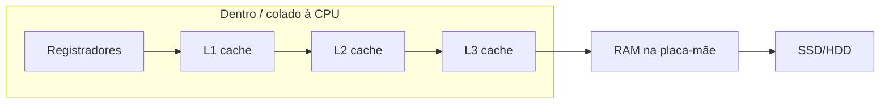
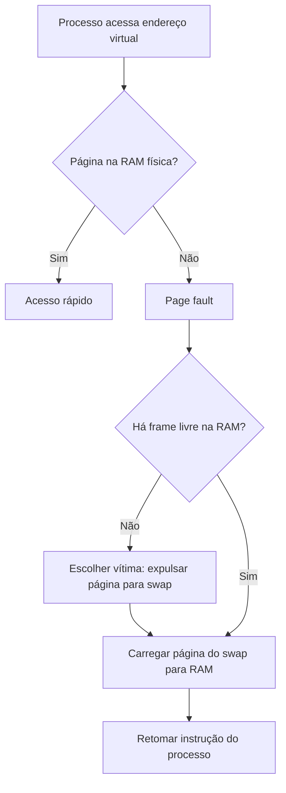

# Memória: física no PC, frequências, swap, limites, loops e “ponteiros”

Complemento de [memoryandreferences.md](memoryandreferences.md). Aqui entra **curiosidade de hardware**, **por que existe swap**, **ordens de grandeza**, **limites**, e **diagramas** (Mermaid + ASCII) — em editores como VS Code/Cursor/GitHub os blocos `mermaid` podem ser pré-visualizados com extensão ou no site [mermaid.live](https://mermaid.live).

Não há fotos binárias no repositório; fluxos e “desenhos” são **texto** renderizável.

---

## 1. Onde isso fica fisicamente no computador (desktop típico)

```
  ┌────────────────────────────────────────────────────────────────┐
  │                         PLACA-MÃE                              │
  │                                                                │
  │    ┌─────────────────┐                                         │
  │    │       CPU       │      ┌──────┐ ┌──────┐ ┌──────┐         │
  │    │  núcleos        │      │ RAM  │ │ RAM  │ │ RAM  │  slots  │
  │    │  L1 · L2 · L3   │      └──────┘ └──────┘ └──────┘  DIMM   │
  │    └────────┬────────┘          (trilhas DDR na placa)         │
  │             │                                                  │
  └─────────────┼──────────────────────────────────────────────────┘
                │
         ┌──────┴──────┐
         │  SSD/HDD    │      cabo SATA, ou M.2 encaixado na placa
         └─────────────┘
```

- **CPU** (processador): pastilha no soquete; **dentro** dela ou colada no mesmo pacote estão **registradores** e **caches L1/L2** (por núcleo) e muitas vezes **L3** compartilhado entre núcleos.
- **RAM**: pentes encaixados nos **slots DIMM** na placa-mãe, perto da CPU para caminho elétrico curto.
- **SSD/HDD**: ligado por **SATA**, **NVMe (M.2)** direto na placa, etc. — fisicamente **longe** da CPU em termos de latência (milhões de ciclos de espera).

Diagrama lógico da **hierarquia** (dados “mais perto” da CPU = mais rápidos, em geral menores):



---

## 2. “Frequências” e impactos (ordem de grandeza)

Aqui “frequência” aparece em contextos diferentes:

| Componente | O que medimos | Ordem de grandeza típica (2020s, varia muito) | Impacto prático |
|------------|----------------|-----------------------------------------------|-----------------|
| **CPU** | Clock (GHz) | ~2–6 GHz | Quantas operações simples por segundo *em tese*; pipeline/cache mudam o real. |
| **RAM DDR** | Taxa de transferência (MT/s) ou etiqueta “DDR4-3200” | Centenas a milhares MT/s; **latência** ainda é ~nanossegundos por acesso | Quanto mais rápida/latência menor, menos a CPU “espera” dados da RAM. |
| **Cache** | Integrado à CPU, muito mais rápido que RAM | Nanossegundos | Dados quentes ficam no cache → programa parece mais rápido. |
| **SSD NVMe** | MB/s, IOPS | Milhares MB/s leitura sequencial; latência **micros** a **dezenas de micros** | Rápido para disco, **lentíssimo** comparado à RAM. |
| **HDD** | RPM + seek | Latência de **milissegundos** em acessos aleatórios | Pior cenário para swap. |

**Ideia:** cada salto **CPU → RAM → disco** é um salto de **latência** enorme. Por isso swap “doi”: o SO está a ir buscar páginas ao disco como se fosse “RAM lenta”.

---

## 3. Swap — o que é e **por que** o SO usa disco quando “falta” RAM

A sua intuição está certa: quando a **RAM física** está sob pressão, o sistema operacional pode **tirar páginas** de memória que estão “menos urgentes” e **gravá-las numa área de disco** chamada **swap** (Windows: arquivo/partição de paginação; Linux: swap partition/file).

### 3.1 Por que fazer isso?

- **RAM é cara e limitada** em cada máquina; **disco** é maior e barato por GB.
- Muitos processos pedem mais **memória virtual** do que cabe de uma vez na RAM **sem** matar programas.
- O SO **finge** que há mais RAM: só parte dos dados precisa estar **fisicamente** na RAM **agora**; o resto pode “dormir” no swap até ser preciso.

### 3.2 O custo

Quando o programa **acessa** uma página que está só no swap, ocorre **page fault** caro: o SO tem de **ler do disco** (e às vezes **expulsar** outra página da RAM para aí). Isso é **ordens de magnitude** mais lento que RAM.

Fluxo simplificado:



### 3.3 Thrashing

Se RAM é pouca e **tudo** oscila entre RAM e swap constantemente, a máquina **só pagina** — CPU fica ociosa à espera de disco. Chama-se **thrashing**. Sintoma: disco a 100%, sistema trava.

---

## 4. Limites de memória (várias camadas)

| Limite | O quê limita |
|--------|----------------|
| **Endereçamento** | Em **32 bits**, espaço virtual por processo típico ~2–4 GB úteis (depende do SO); **64 bits** permite espaços enormes (na prática limitados por SO e hardware). |
| **RAM instalada** | Quantos GB você tem nos pentes + o que a placa-mãe/CPU suportam. |
| **Heap da JVM** | `-Xmx` (máximo heap); sem isso, defaults e ergonomics da JVM. **OutOfMemoryError** no heap quando não há espaço **e** o GC não libera o suficiente. |
| **Stack** | Por thread; **StackOverflowError** se a cadeia de chamadas (ou recursão infinita **real**) estoura o tamanho da stack. |
| **ulimit / quotas** | Em Linux, limites do utilizador; containers têm limites de memória. |

**“Memória virtual”** ≠ RAM física total: pode haver processos cuja soma de “memória virtual pedida” **excede** a RAM; o SO pagina e usa swap — até o limite de disco + políticas.

---

## 5. Loop infinito — enche a RAM?

**Depende.**

```java
while (true) { }           // só consome CPU (e energia); **não** aloca heap por si
```

```java
while (true) {
    new byte[1024 * 1024]; // aloca sem liberar referência → heap cresce → eventualmente OOM
}
```

- **`while (true)` vazio** ou que só faz contas em primitivos: **não** cresce o heap; podes ter **100% CPU** num núcleo.
- **Loop que aloca** e guarda referências (lista, array global, etc.): **sim**, pode esgotar heap ou pressionar GC até OOM.
- **Recursão infinita** (`void f(){ f(); }`): em geral **StackOverflowError**, não “falta de heap”.

---

## 6. Ponteiros — um pouco mais fundo (C vs Java)

### 6.1 C (ou C++): ponteiro explícito

- Uma variável `int* p` guarda um **endereço de memória** (número).
- Podes fazer **aritmética** (`p+1` no sentido de avançar `sizeof(int)`), **cast** perigoso, aceder a memória inválida → **segfault**.

Esquema mental:

```text
  p  ────────►  [ endereço 0x... ] ──►  área de memória (stack/heap)
                    valor = 0x7fff0000
```

### 6.2 Java: referência (ponteiro opaco)

- A variável `String s` guarda uma **referência**: o compilador/JVM **não** te deixa ver o número nem fazer `s + 1`.
- Garantias extra: se o **GC** mover objetos, a referência pode ser **atualizada** por baixo (não é você que ajusta).
- **Sem** acesso a memória arbitrária → menos poder, mais segurança.

```text
  s  ────────►  (referência opaca) ──►  objeto String no heap
```

### 6.3 “Passar ponteiro” em entrevista

- **C:** você pode passar `int*` e o chamado alterar o `int` no chamador (passagem de endereço).
- **Java:** você passa a **cópia da referência**; mutar **dentro** do objeto compartilhado é visível; **reatribuir** o parâmetro `s = outra` não muda a variável de quem chamou.

---

## 7. Resumo visual: de onde vem a lentidão do swap

```text
  Acesso típico:
  Registrador     ~ 1 ciclo
  L1 cache      ~ poucos ciclos
  RAM           ~ centenas de ciclos
  SSD           ~ dezenas/centenas de micros  (milhões de ciclos)
  HDD           ~ ms                         (milhões a bilhões de ciclos)
```

Por isso o SO **prefere** RAM; swap é **último recurso** para não matar processos de imediato, não para performance.

---

## 8. Onde continuar

- [memoryandreferences.md](memoryandreferences.md) — modelo Java, stack/heap, pass-by-value.
- [cpucachejvmenavegador.md](cpucachejvmenavegador.md) — cache da CPU vs cache do navegador, por que números “baixos”, o que é guardado, JVM não “força” L1.
- `core` → `jvmmemorymodelintro.md`, `GarbageCollectorBasics`, `multithreadingintro.md`.
